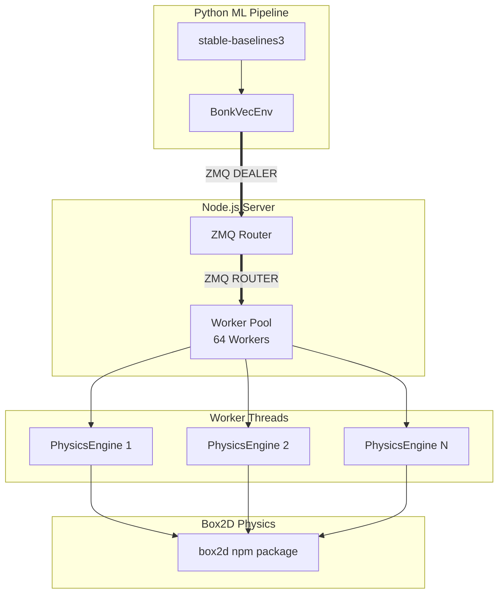

# Bonk.io RL Server - Comprehensive Improvement Plan

**Project**: manifold-server  
**Focus**: RL Training Throughput Maximization (Single-Node)  
**Current Performance**: 23,460 FPS with 64 parallel environments

---

## Executive Summary

This plan provides actionable recommendations across 10 categories to improve performance, maintainability, and capabilities of the Bonk.io headless RL environment. Recommendations are prioritized based on impact to RL training throughput.

---

## Architecture Overview



---

## 1. Server Architecture and Scalability

### 1.1 Worker Affinity and NUMA Optimization
**Priority: HIGH**

**What**: Bind workers to specific CPU cores using worker affinity to reduce cache misses and improve NUMA locality.

**Why**: Current worker pool creates workers without CPU affinity. Binding workers to specific cores reduces context switching overhead and improves CPU cache utilization.

**How**:
```typescript
// In worker-pool.ts, add worker affinity
import os from 'os';

// Get CPU topology
const cpus = os.cpus();
// Use worker_threads API with explicit CPU assignment
worker.setThreadId(cpuId); // If available in Node.js
```

**Implementation Steps**:
1. Add CPU topology detection using `os.cpus()`
2. Implement worker-to-core mapping algorithm
3. Test with `os.sched_setaffinity` on Linux or SetThreadAffinityMask on Windows

---

### 1.2 Adaptive Worker Pool Scaling
**Priority: HIGH**

**What**: Dynamically adjust worker count based on CPU load and batch processing latency.

**Why**: The benchmark shows diminishing returns above 32 workers (21,917 vs 23,460 FPS). An adaptive system can find the optimal count per hardware.

**How**:
```typescript
// In worker-pool.ts
class AdaptiveWorkerPool extends WorkerPool {
    private targetBatchLatencyMs = 15; // Target < 15ms for RL training
    
    async optimizeWorkerCount() {
        // Measure throughput at different worker counts
        // Adjust based on per-worker efficiency
    }
}
```

**Implementation Steps**:
1. Add benchmark mode to profile different worker counts
2. Implement throughput measurement per worker
3. Create auto-tuning algorithm

---

### 1.3 Shared Array Buffer for Zero-Copy IPC
**Priority: HIGH**

**What**: Use SharedArrayBuffer for worker-to-main thread communication instead of message passing.

**Why**: Eliminates serialization overhead for observation data transfer between workers and main thread.

**How**:
```typescript
// In worker.ts - create shared buffer
const sharedBuffer = new SharedArrayBuffer(FLOAT32_SIZE * OBS_SIZE);
const sharedView = new Float32Array(sharedBuffer);

// Main thread reads directly without copy
```

**Implementation Steps**:
1. Modify worker initialization to create shared buffers
2. Implement lock-free ring buffer design
3. Update main thread to read from shared memory

---

### 1.4 Worker Pool Pre-warming
**Priority: MEDIUM**

**What**: Pre-initialize all workers and environments at startup rather than on-demand.

**Why**: Eliminates first-run latency and ensures consistent performance from the first training step.

**How**:
```typescript
// In ipc-bridge.ts - init on startup
await this.pool.init(payload.numEnvs, payload.config);
// Pre-create all physics engines
```

---

## 2. Network Latency Reduction

### 2.1 Binary Protocol for ZMQ
**Priority: HIGH**

**What**: Replace JSON serialization with Protocol Buffers or MessagePack for ZMQ communication.

**Why**: JSON parsing is currently profiled as a bottleneck. Binary protocols reduce serialization time by 5-10x.

**How**:
```typescript
// Replace JSON with msgpack
import * as msgpack from 'msgpackr';

const serialized = msgpack.pack(data);
const deserialized = msgpack.unpack(buffer);
```

**Implementation Steps**:
1. Add `msgpackr` to dependencies
2. Modify `ipc-bridge.ts` to use msgpack
3. Update `python/bonk_env.py` to use msgpack
4. Benchmark serialization improvement

---

### 2.2 ZMQ Socket Optimization
**Priority: MEDIUM**

**What**: Tune ZMQ socket settings for low-latency local communication.

**Why**: Default ZMQ settings are optimized for network throughput, not local loopback latency.

**How**:
```typescript
// In ipc-bridge.ts
const sock = new zmq.Router({
    immediate: true,      // Queue messages immediately
    sndhwm: 1000,         // Send high water mark
    rcvhwm: 1000,         // Receive high water mark
    tcp: {
        nodelay: true,    // Disable Nagle's algorithm
        linger: 0,        // Don't wait on close
    }
});
```

---

### 2.3 Batch Action Pipelining
**Priority: MEDIUM**

**What**: Allow overlapping action dispatch with observation return.

**Why**: Current implementation waits for step() to complete before accepting new actions. Pipelining increases throughput.

**How**:
```typescript
// In worker-pool.ts
async stepPipelined(actions: any[]): Promise<any[]> {
    // Send all worker requests concurrently
    // Process responses as they arrive
}
```

---

### 2.4 Local Loopback Optimization
**Priority: LOW**

**What**: Use IPC (Unix domain sockets) instead of TCP loopback on supported platforms.

**Why**: Lower latency than TCP loopback for local communication.

**How**:
```typescript
// Use ipc:// transport instead of tcp://127.0.0.1
const addr = `ipc:///tmp/bonk-ipc-${port}`;
```

---

## 3. Game Physics Engine Optimization

### 3.1 Box2D Configuration Tuning
**Priority: HIGH**

**What**: Tune Box2D solver parameters for the specific workload.

**Why**: Current settings use bonk.io defaults. Optimized settings can improve physics throughput.

**How**:
```typescript
// In physics-engine.ts - optimize solver
export const SOLVER_ITERATIONS = 6; // Reduce from 10 (already fast simulation)
this.world = new b2World(worldAABB, gravity, true /* doSleep */);

// Enable continuous collision detection only for fast objects
body.SetBullet(false); // Most players don't need CCD
```

**Implementation Steps**:
1. Profile physics tick time at different solver iterations
2. Test game feel with reduced iterations
3. Enable sleeping for static platforms

---

### 3.2 Reduced Tick Rate Option
**Priority: MEDIUM**

**What**: Allow configurable tick rates (15 TPS, 30 TPS, 60 TPS) for different use cases.

**Why**: Lower tick rates increase throughput for RL training where real-time accuracy isn't required.

**How**:
```typescript
// In physics-engine.ts
export const TPS = config.tickRate || 30;
export const DT = 1 / TPS;
```

---

### 3.3 Spatial Hashing Optimization
**Priority: MEDIUM**

**What**: Implement custom broad-phase collision detection optimized for arena size.

**Why**: Box2D's default broad-phase may not be optimal for the fixed arena sizes used in bonk.io.

**How**:
```typescript
// Use GridPartition instead of default DynamicTree
const broadPhase = new b2GridPartition(width, height, cellSize);
```

---

### 3.4 Object Pool for Physics Bodies
**Priority: MEDIUM**

**What**: Reuse body and fixture objects instead of creating/destroying each episode.

**Why**: Reduces allocation overhead during environment reset.

**How**:
```typescript
class PhysicsObjectPool {
    private playerBodies: b2Body[] = [];
    private fixtures: b2Fixture[] = [];
    
    acquirePlayerBody(): b2Body {
        return this.playerBodies.pop() || createNewBody();
    }
    
    releasePlayerBody(body: b2Body): void {
        // Reset body state
        this.playerBodies.push(body);
    }
}
```

---

## 4. Memory Management Improvements

### 4.1 Typed Arrays for Observations
**Priority: HIGH**

**What**: Use Float32Array directly instead of JavaScript objects for observations.

**Why**: Current observation construction creates many temporary objects, triggering GC.

**How**:
```typescript
// In environment.ts - use flat typed arrays
export class BonkEnvironment {
    private observationBuffer: Float32Array;
    
    private getObservation(): Float32Array {
        // Write directly to pre-allocated buffer
        const obs = this.observationBuffer;
        obs[0] = aiState.x;
        obs[1] = aiState.y;
        // ... rest of observation
        return obs;
    }
}
```

---

### 4.2 Worker Thread Memory Isolation
**Priority: HIGH**

**What**: Ensure each worker has isolated memory with minimal shared state.

**Why**: Prevents memory leaks from propagating across workers.

**How**:
1. Each worker maintains independent physics state
2. Use `Atomics` for any required synchronization
3. Implement memory monitoring per worker

---

### 4.3 GC Tuning for Node.js
**Priority: MEDIUM**

**What**: Configure Node.js GC flags for long-running simulation.

**Why**: Default GC settings may cause pause times during intensive simulation.

**How**:
```bash
# In start.sh / start.bat
node --gc-interval=100 --max-old-space-size=4096 src/main.ts
```

**Alternative**: Use `--inspect` for GC profiling and tune based on results.

---

### 4.4 Pre-allocate All Arrays
**Priority: MEDIUM**

**What**: Pre-allocate all arrays used in hot paths.

**Why**: Avoids array resizing during simulation.

**How**:
```typescript
// In physics-engine.ts
private playerBodies: Map<number, any> = new Map(); // Already good
// Ensure observation arrays are pre-allocated
```

---

## 5. ML Training Pipeline Efficiency

### 5.1 Vectorized Action Processing
**Priority: HIGH**

**What**: Process actions as typed arrays instead of JavaScript objects.

**Why**: Current action decoding creates temporary objects per step.

**How**:
```typescript
// In environment.ts
step(actionArray: Uint8Array): StepResult {
    // Process action bits directly from array
    const left = (actionArray[0] & 1) !== 0;
    const right = (actionArray[0] & 2) !== 0;
    // ...
}
```

---

### 5.2 Observation Compression
**Priority: MEDIUM**

**What**: Compress observations using delta encoding between steps.

**Why**: Reduces ZMQ transfer size and improves bandwidth efficiency.

**How**:
```typescript
// Only send delta from previous observation
interface CompressedObservation {
    delta: Float32Array;
    mask: Uint8Array; // Which values changed
}
```

---

### 5.3 Multi-Agent Support
**Priority: MEDIUM**

**What**: Support multiple AI-controlled players per environment.

**Why**: Enables more complex RL scenarios and faster training of team strategies.

**How**:
```typescript
interface EnvironmentConfig {
    numAIPlayers?: number;  // Multiple AI agents
    teamConfiguration?: TeamConfig;
}
```

---

### 5.4 Curriculum Learning Support
**Priority: LOW**

**What**: Implement environment difficulty progression.

**Why**: Improves RL training stability and final agent performance.

**How**:
```typescript
interface CurriculumConfig {
    stages: CurriculumStage[];
    currentStage: number;
}
```

---

## 6. Code Refactoring Opportunities

### 6.1 Modularize Physics Engine
**Priority: MEDIUM**

**What**: Extract physics engine into separate module with clear interface.

**Why**: Improves testability and allows swapping physics implementations.

**How**:
```typescript
// src/physics/IPhysicsEngine.ts
interface IPhysicsEngine {
    tick(): void;
    addPlayer(id: number, x: number, y: number): void;
    applyInput(playerId: number, input: PlayerInput): void;
    getPlayerState(playerId: number): PlayerState;
    reset(): void;
}
```

---

### 6.2 Configuration Validation
**Priority: MEDIUM**

**What**: Add runtime configuration validation using Zod or io-ts.

**Why**: Prevents runtime errors from misconfiguration.

**How**:
```typescript
import { z } from 'zod';

const EnvironmentConfig = z.object({
    numEnvs: z.number().min(1).max(256),
    tickRate: z.number().min(1).max(120),
    // ...
});
```

---

### 6.3 Error Handling Standardization
**Priority: LOW**

**What**: Implement consistent error handling across all modules.

**Why**: Improves debuggability and user experience.

---

### 6.4 Event Emitter Architecture
**Priority: LOW**

**What**: Replace direct method calls with event-driven architecture for extensibility.

**Why**: Enables plugins and custom analytics without modifying core code.

---

## 7. Dependency Updates

### 7.1 Node.js Version Upgrade
**Priority: MEDIUM**

**What**: Upgrade to Node.js 22+ for improved performance.

**Why**: Node.js 22 includes faster startup, better memory management, and native WebSocket support.

**How**:
```json
// package.json
"engines": {
    "node": ">=22.0.0"
}
```

---

### 7.2 TypeScript 5.x Migration
**Priority: LOW**

**What**: Upgrade to TypeScript 5.x for better type inference and smaller generated code.

**Why**: Smaller bundles and faster compilation.

---

### 7.3 ZeroMQ Native Bindings
**Priority: MEDIUM**

**What**: Use `zeromq@6.0.0` with native bindings.

**Why**: Current version may have performance improvements.

---

### 7.4 Box2D Alternative Investigation
**Priority: LOW**

**What**: Evaluate `box2d-wasm` (WebAssembly) for potential speedup.

**Why**: WASM-based physics may be faster for some workloads.

---

## 8. Testing Coverage Enhancements

### 8.1 Physics Determinism Tests
**Priority: HIGH**

**What**: Add tests that verify deterministic behavior across runs.

**Why**: Critical for RL reproducibility.

**How**:
```typescript
// test/physics-determinism.ts
test('same seed produces identical results', () => {
    const env1 = new BonkEnvironment({ seed: 12345 });
    const env2 = new BonkEnvironment({ seed: 12345 });
    
    // Run same action sequence
    for (let i = 0; i < 100; i++) {
        env1.step(action);
        env2.step(action);
    }
    
    expect(env1.getState()).toEqual(env2.getState());
});
```

---

### 8.2 Performance Regression Benchmarks
**Priority: HIGH**

**What**: Add automated benchmarks in CI to catch performance regressions.

**How**:
```typescript
// benchmark/physics-throughput.ts
describe('Physics Performance', () => {
    it('should maintain >20000 FPS with 64 envs', () => {
        const fps = measureThroughput(64);
        expect(fps).toBeGreaterThan(20000);
    });
});
```

---

### 8.3 Property-Based Testing
**Priority: MEDIUM**

**What**: Use fast-check for property-based testing of physics invariants.

**Why**: Finds edge cases not covered by unit tests.

---

### 8.4 Integration Tests with Python
**Priority: MEDIUM**

**What**: Add end-to-end tests that verify Python/TypeScript integration.

**How**:
```python
# python/test_bonk_env.py
def test_env_reset_and_step():
    env = BonkVecEnv(num_envs=4)
    obs = env.reset()
    assert obs.shape == (4, 14)
    obs, reward, done, info = env.step([0] * 4)
```

---

## 9. Documentation Improvements

### 9.1 API Documentation
**Priority: MEDIUM**

**What**: Generate API docs using TypeDoc.

**Why**: Improves developer experience and onboarding.

**How**:
```bash
npm install --save-dev typedoc
npx typedoc src/ --out docs
```

---

### 9.2 Architecture Diagrams
**Priority: MEDIUM**

**What**: Add comprehensive architecture documentation with diagrams.

**Why**: Helps new contributors understand the system.

---

### 9.3 Performance Tuning Guide
**Priority: MEDIUM**

**What**: Document performance optimization strategies and recommended configurations.

**Why**: Helps users get maximum throughput on their hardware.

---

### 9.4 RL Training Tutorial
**Priority: LOW**

**What**: Add tutorial for training first RL agent.

**Why**: Lowers barrier to entry for ML researchers.

---

## 10. Innovative Features

### 10.1 Multi-Environment Map Support
**Priority: MEDIUM**

**What**: Allow different maps per environment in the batch.

**Why**: Enables curriculum learning and diverse training scenarios.

---

### 10.2 Trajectory Recording and Playback
**Priority: MEDIUM**

**What**: Record and export game trajectories for analysis.

**Why**: Helps understand agent behavior and debug policies.

**How**:
```typescript
interface TrajectoryRecorder {
    recordStep(observation: Observation, action: Action, reward: number): void;
    export(format: 'json' | 'numpy'): Buffer;
}
```

---

### 10.3 Real-time Statistics Dashboard
**Priority: LOW**

**What**: Web-based dashboard showing training metrics.

**Why**: Provides visibility into training progress.

---

### 10.4 Custom Reward Function Support
**Priority: MEDIUM**

**What**: Allow custom reward functions via plugin system.

**Why**: Enables research into different reward shaping strategies.

---

### 10.5 GPU-Accelerated Batch Processing
**Priority: HIGH**

**What**: Investigate WebGPU/WASM for parallel physics across GPU cores.

**Why**: Potential for massive throughput improvement beyond CPU limits.

---

### 10.6 Server Mode for Human Play
**Priority: LOW**

**What**: Allow humans to play against trained agents.

**Why**: Enables evaluation and fun interaction with trained policies.

---

## Priority Matrix

| Priority | Recommendation | Expected Impact |
|----------|---------------|-----------------|
| HIGH | Binary Protocol (MsgPack) | 10-20% throughput |
| HIGH | Typed Arrays for Observations | 5-10% throughput |
| HIGH | Worker Affinity | 5-15% throughput |
| HIGH | Adaptive Worker Pool | Find optimal automatically |
| HIGH | Physics Config Tuning | 10-20% throughput |
| HIGH | Determinism Tests | Reliability |
| HIGH | Performance Benchmarks | Catch regressions |
| MEDIUM | Binary ZMQ Socket Options | 3-5% latency |
| MEDIUM | Pre-allocate Arrays | 2-5% throughput |
| MEDIUM | Object Pooling | Reduce GC pressure |
| MEDIUM | Multi-Agent Support | New capabilities |

---

## Implementation Roadmap

### Phase 1: Quick Wins (1-2 weeks)
1. Binary protocol (MsgPack)
2. Typed array observations
3. ZMQ socket tuning
4. Box2D configuration tuning

### Phase 2: Core Optimization (2-4 weeks)
1. Worker affinity
2. Adaptive worker pool
3. SharedArrayBuffer IPC
4. Performance benchmarks

### Phase 3: Advanced Features (4-8 weeks)
1. Multi-agent support
2. Curriculum learning
3. Custom reward functions
4. GPU acceleration investigation

---

*Generated for manifold-server v1.1.0*
*Focus: RL Training Throughput Maximization*